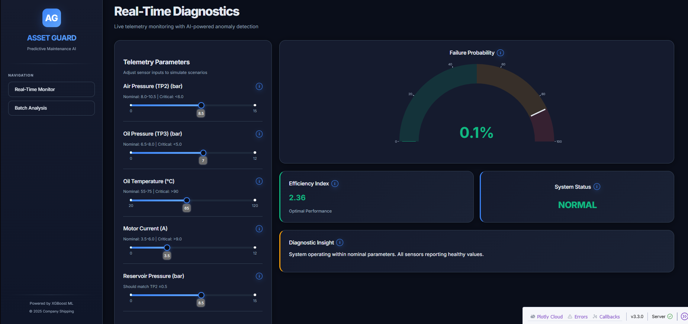
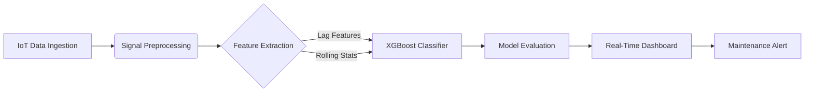
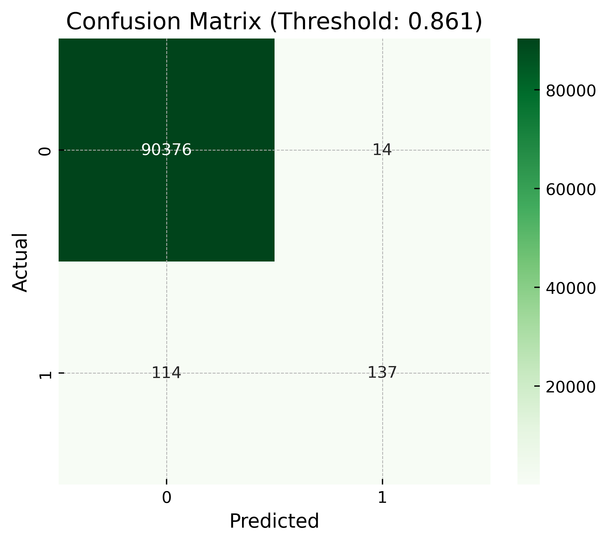
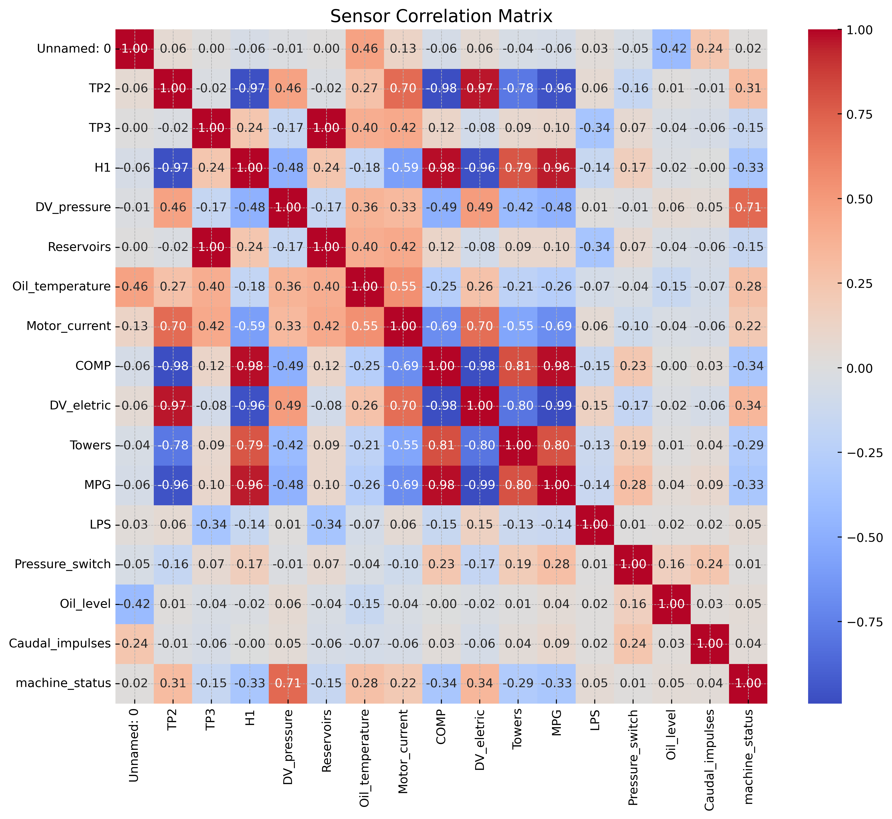
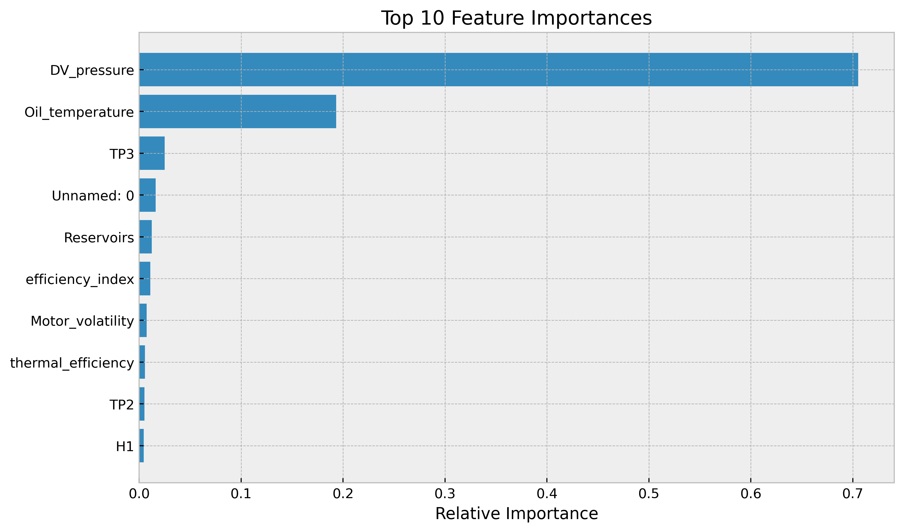
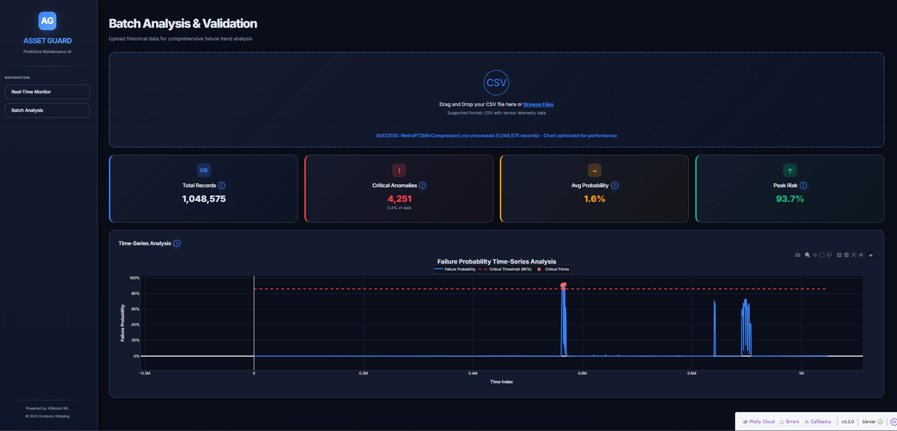
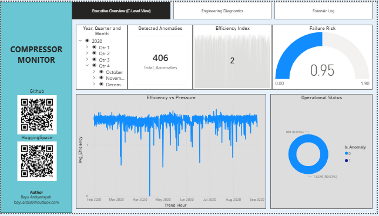
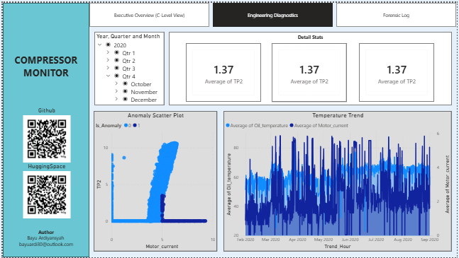
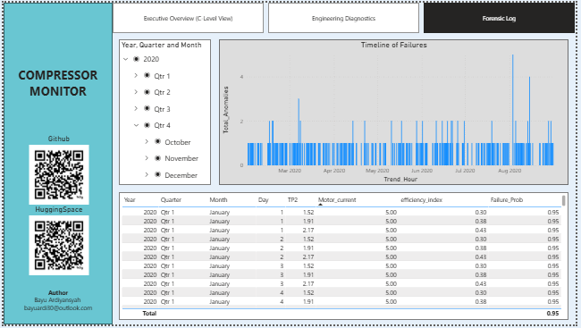

<div align="center">

# INDUSTRIAL COMPRESSOR PREDICTIVE MAINTENANCE

### IoT-Enabled Digital Twin for Anomaly Detection & Failure Prediction

**[Live Demo](https://huggingface.co/spaces/SlRazer/industrial-compressor-predictive-maintenance)** • **[Methodology](https://www.google.com/search?q=%23-methodology)** • **[Benchmarks](https://www.google.com/search?q=%23-model-performance-evaluation)** • **[Visual Analysis](https://www.google.com/search?q=%23-analytical-visualizations)**




</div>

## Project Ontology

**Industrial Compressor Predictive Maintenance** is an industrial-grade analytics framework designed to monitor the health status of air compressors in real-time. This system functions as a Digital Twin, simulating operational states to detect anomalies and predict potential equipment failures before they occur.

Unlike standard preventive maintenance (scheduled checks), this project integrates **XGBoost Machine Learning** models with high-frequency IoT telemetry. It analyzes thermodynamic parameters—such as pressure, temperature, and motor current—to classify the machine state into specific failure modes or healthy operation. The system handles end-to-end workflows from raw sensor data processing to a real-time diagnostic dashboard.

## Dataset & Sensor Telemetry

The analysis is based on the **MetroPT3 (Air Compressor)** dataset, collecting real-world signals from a compressor unit. The data processing pipeline enforces strict signal processing rules to ensure noise reduction and validity.

* **Dataset Source:** [UCI Machine Learning Repository / Kaggle - MetroPT3 Dataset](https://archive.ics.uci.edu/dataset/791/metropt+3+dataset)
* **Key Variables:**
* **TP2 (Pressure):** Discharge pressure in bar.
* **Motor Current:** Phase current consumption in Amperes.
* **H1 (Temperature):** Oil temperature at the relief valve.
* **Flow Rate:** Air flow volume generated.


## Methodology

The system adheres to a rigorous engineering data science pipeline, visualized below:



1. **IoT Data Ingestion:** Loading raw telemetry data containing high-frequency sensor readings.
2. **Signal Preprocessing:** Cleaning data, handling missing values, and normalizing sensor scales.
3. **Feature Extraction:** Creation of domain-specific features such as rolling averages and standard deviations to capture temporal dependencies.
4. **Predictive Modeling:** Implementation of the XGBoost (Extreme Gradient Boosting) algorithm to classify the compressor's state (Healthy vs. Anomaly).
5. **Strategic Visualization:** Deployment of an interactive interface using Streamlit/Plotly for live monitoring and historical log analysis.

---

## Model Performance Evaluation

The predictive model has been rigorously evaluated using standard classification metrics. The Confusion Matrix below demonstrates the model's ability to distinguish between normal operation and failure states with high precision.

<div align="center">

| Metric | Description |
| --- | --- |
| **Accuracy** | Overall correctness of the state classification. |
| **Precision** | Accuracy of positive failure predictions. |
| **Recall** | Ability to detect all actual failure instances. |
| **F1-Score** | Harmonic mean of precision and recall. |

**Confusion Matrix Analysis**



*Visual representation of True Positives, True Negatives, False Positives, and False Negatives, validating the model's robustness against false alarms.*

</div>

---

## Analytical Visualizations (Python/Streamlit)

This section details the extensive Exploratory Data Analysis (EDA) and Feature Engineering conducted to validate the model's reliability using Python libraries.

### 1. Sensor Correlation & Feature Importance

Analysis of the fundamental relationship between thermodynamic variables and the most critical factors driving the model's decisions.

<div align="center">

| Correlation Matrix | Feature Importance (XGBoost) |
| --- | --- |
|  |  |
| *Heatmap showing relationships between Pressure (TP2), Temperature (H1), and Current.* | *Ranking of the top 10 sensors influencing the prediction.* |

</div>

### 2. Application Interface & Diagnostics

The deployed application provides both a real-time overview and deep-dive capabilities into the machine's historical data.

<div align="center">

| **Real-Time Monitoring Interface** | **Diagnostic View & Historical Log** |
| --- | --- |
|  |  |
| *Live telemetry tracking of Pressure and Efficiency.* | *Detailed log analysis for root cause investigation.* |

</div>

---

## Strategic Business Intelligence (Power BI)

Complementing the real-time Digital Twin, a high-level **Strategic Business Intelligence Dashboard** was developed using Microsoft Power BI. This module translates technical telemetry into executive-level insights using advanced **DAX (Data Analysis Expressions)**.

### Dashboard Architecture

The report is divided into three strategic levels: Executive Overview, Engineering Diagnostics, and Forensic Logs.

<div align="center">

| **Page 1: Executive Overview** | **Page 2: Sensor Diagnostic Lab** |
| --- | --- |
|  |  |
| *Macro-level health check, KPI monitoring (Efficiency Index, Failure Probability).* | *Engineering analysis using Scatter Plots for anomaly clustering.* |

**Page 3: Forensic Event Logs**



*Detailed audit trail containing timestamps and specific sensor readings during detected anomaly events.*

</div>

### Technical Implementation

The Power BI report utilizes a **Star Schema** approach to optimize query performance on large telemetry datasets.

* **Key DAX Measures:**
* **Avg Efficiency:** `CALCULATE(AVERAGE(Efficiency_Index), Efficiency_Index > 0)`
* **Total Anomalies:** `CALCULATE(COUNTROWS(Table), Is_Anomaly = 1)`
* **Failure Probability:** Logic-based risk scoring derived from anomaly frequency and efficiency drops.


---

## Installation & Usage

To deploy the dashboard locally:

**1. Clone the repository**

```bash
git clone https://github.com/RazerArdi/Industrial-Compressor-Predictive-Maintenance
cd Industrial-Compressor-Predictive-Maintenance

```

**2. Install Dependencies**
Ensure you have Python installed, then run:

```bash
pip install pandas numpy scikit-learn plotly streamlit xgboost joblib

```

**3. Run the Dashboard**
Execute the interface script:

```bash
streamlit run Interface/app.py

```

Access the dashboard at `http://localhost:8501/` in your browser.

---

## Directory Structure

```text
Project_Root/
+---Data/
|   +---Images/
|   |       AppDashboard_1.png
|   |       AppDashboard_2.png
|   |       confusion_matrix.png
|   |       PowerBIPage1.png
|   |       PowerBIPage2.png
|   |       PowerBIPage3.png
|   |       sensor_correlation_matrix.png
|   |       top10_feature_importances.png
|   |
|   +---Table/
|           classification_report.csv
|           confusion_matrix.csv
|           sensor_correlation_matrix.csv
|           top10_feature_importances.csv
|
+---Dataset/
|       .gitkeep
|       Data Description_Metro.pdf
|       MetroPT3(AirCompressor).csv
|       Test.csv
|
+---Interface/
|       app.py
|
+---Model/
|       model_features.pkl
|       xgb_compressor_model.pkl
|
+---Notebook/
|       main.ipynb
|       main.py
|
+---Report/
        Report.pbix

```

---

# Acknowledgements

I would like to express my gratitude to the following resources and communities that made this project possible.

### Dataset & Resources

* **Dataset Source:** [UCI Machine Learning Repository - MetroPT3](https://archive.ics.uci.edu/dataset/791/metropt+3+dataset)
* **Context:** A comprehensive collection of compressor operational data covering Pressure, Temperature, and Motor Current variables used for predictive maintenance.

### Frameworks & Libraries

This project relies on the open-source ecosystem:

* **Streamlit & Plotly:** For building the interactive Industrial Dashboard and Data Visualization.
* **Microsoft Power BI:** For Strategic Business Intelligence and Executive Reporting.
* **XGBoost:** For high-performance gradient boosting classification.
* **Pandas & NumPy:** For high-performance data manipulation.

### Academic Context

* **Institution:** Universitas Muhammadiyah Malang (UMM)
* **Department:** Informatics Engineering
* **Focus:** Industrial IoT Analytics & Machine Learning

---

<div align="center">

**Developed by Bayu Ardiyansyah**

*Email: bayuardi30@outlook.com*

**Developed for Industrial Strategic Intelligence**

</div>